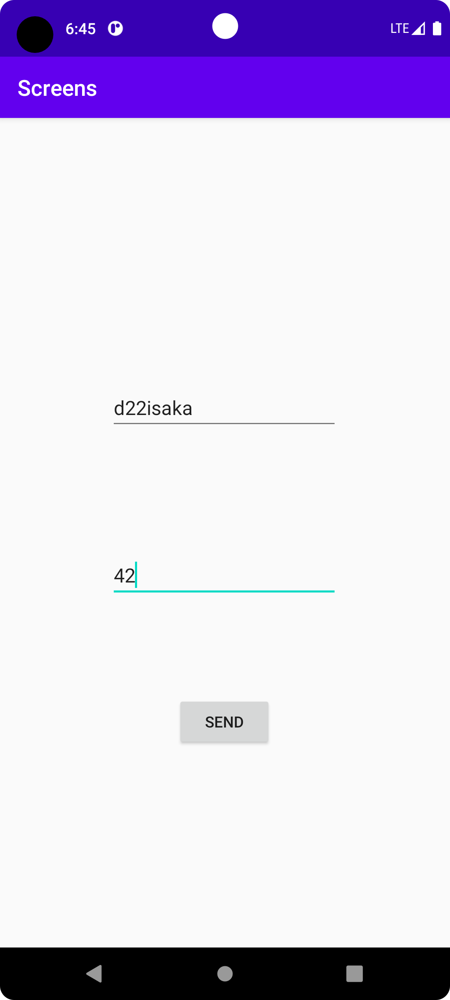
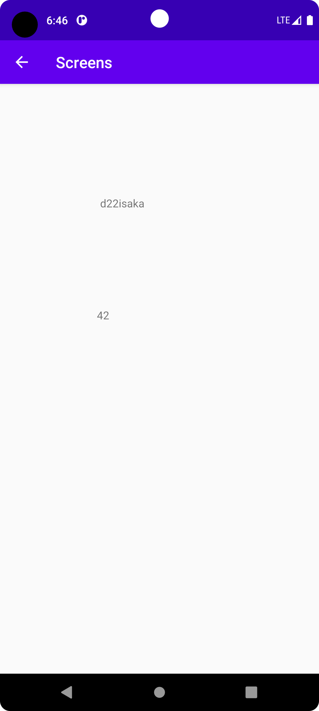

# Rapport

Forked the GitHub project.
Created a second activity called ShowActivity.
Added a button that opens the ShowActivity.
Made MainActivity as parent, so you can go back to start from ShowActivity.
Added 2 widgets in showactivity to show the values inserted in main.

Below code declares the name and number variables by taking the values of what the user inserted in the main screen
before pressing the sendbutton. And then shows it on the activityscreen.

```
Bundle extras = getIntent().getExtras();
        if (extras != null) {
            String name = extras.getString("name");
            String number = extras.getString("number");

            TextView nameResult = findViewById(R.id.nameView);
            nameResult.setText(name);

            TextView sizeResult = findViewById(R.id.sizeView);
            sizeResult.setText(number);
            // Do something with the name and number
        }
```

The first screenshots shows the main screen.



After inserting whatever value, the show activity mirrors and shows the same values.


Läs gärna:

- Boulos, M.N.K., Warren, J., Gong, J. & Yue, P. (2010) Web GIS in practice VIII: HTML5 and the canvas element for interactive online mapping. International journal of health geographics 9, 14. Shin, Y. &
- Wunsche, B.C. (2013) A smartphone-based golf simulation exercise game for supporting arthritis patients. 2013 28th International Conference of Image and Vision Computing New Zealand (IVCNZ), IEEE, pp. 459–464.
- Wohlin, C., Runeson, P., Höst, M., Ohlsson, M.C., Regnell, B., Wesslén, A. (2012) Experimentation in Software Engineering, Berlin, Heidelberg: Springer Berlin Heidelberg.
